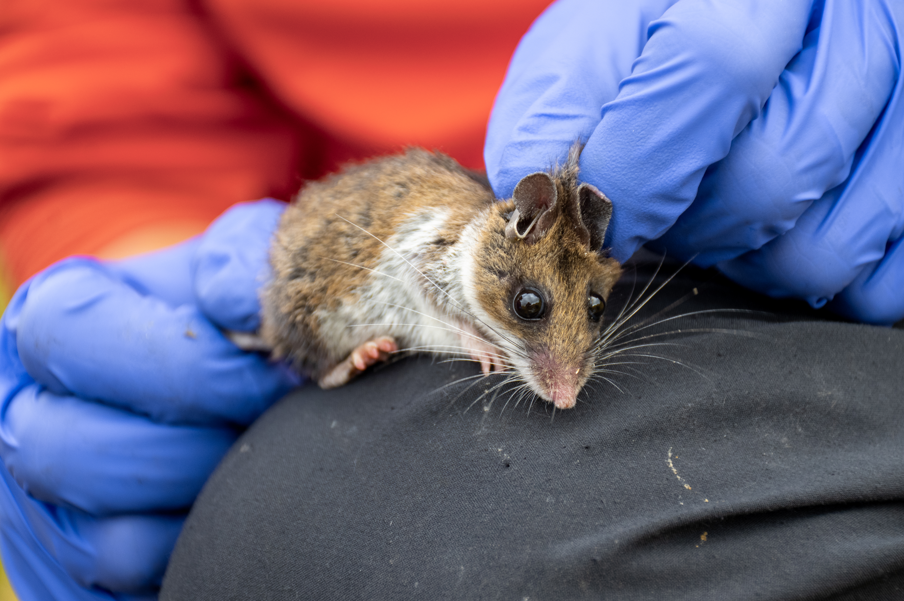
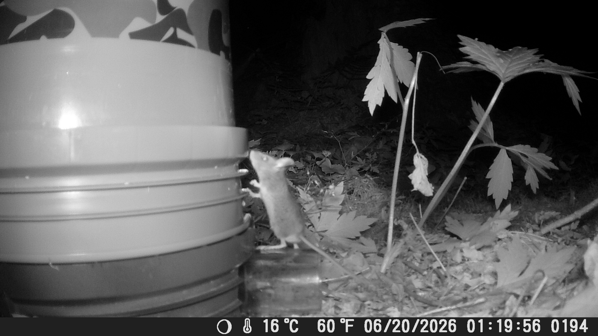

# Moon Mice Project 
Moon Mice is a wildlife ecology research project based in the Burkhard Lab at Lewis & Clark College in Portland, Oregon. Our team studies how animals perceive and respond to environmental variation, with a particular interest in the behavioral and ecological mechanisms that shape habitat use and perceived predation risk.

In this project, we investigate how moonlight, habitat structure, and individual behavior influence activity patterns in wild Western deer mice (***Peromyscus sonoriensis***). By combining camera trapping, environmental data, behavioral observations, and quantitative modeling, we aim to understand how landscapes of fear change across space and time—and whether individual mice experience these landscapes differently.

This repository documents the data, analytical workflows, and visualizations developed as part of the Moon Mice project.

  
   
  <em>Western deer mouse (<i>Peromyscus sonoriensis</i>) photographed during field research.</em>

## How does moonlight shape the behavior of nocturnal rodents?

For small nocturnal mammals, leaving a refuge to forage, move, or find mates comes with a tradeoff: gaining resources while avoiding predators. Because predators are encountered relatively infrequently, animals often respond not to actual predation events, but to environmental cues that signal when and where they may be most vulnerable. This creates a **landscape of fear**—a dynamic pattern of perceived predation risk across space and time.

**The Moon Mice Project** investigates how lunar illumination influences the activity and habitat use of wild **Western deer mice (*Peromyscus sonoriensis*)**. Moonlight provides a natural and predictable source of variation in nighttime visibility, allowing us to ask whether mice alter when and where they are active as the perceived risk of detection changes.

### The central question

> **When the night gets brighter, do deer mice change where and when they move?**

We are particularly interested in how this response depends on **habitat structure**. Vegetation can provide concealment from predators, potentially reducing the risk associated with moonlight. This means that the same lunar conditions may create very different risk environments depending on whether a mouse is moving through open habitat or dense vegetation.

### From moonlight to landscapes of fear

This project scales the study of perceived predation risk across three levels:

**Population → Space & Time → Individual**

1. **Population-level responses**
   We test whether lunar illumination influences overall deer mouse activity and whether this relationship differs between habitats.

2. **Spatiotemporal landscapes of fear**
   We use fine-scale camera trapping and environmental data to model how activity changes across space and throughout the night. Model predictions can then be visualized as dynamic landscapes of perceived risk.

3. **Individual differences**
   We ultimately ask whether individual mice consistently differ in their responses to moonlight and habitat structure, and whether behavioral traits such as risk tolerance help explain these differences.

### Data & analysis

  
 
  <em>Western deer mouse (<i>Peromyscus sonoriensis</i>) captured on a trail camera visiting one of our bucket traps.</em>

The project combines **continuous camera trapping, lunar illumination estimates, habitat measurements, and individual-based observations**. Camera detections are aggregated into 15-minute intervals, allowing activity to be examined at a fine temporal scale across lunar cycles.

This repository contains the data-processing and analytical workflows used to investigate these patterns, including:

* Camera-trap data processing and activity summaries
* Lunar illumination and moon-phase calculations
* Fine-scale temporal activity analyses
* Habitat and canopy measurements
* Statistical modeling of deer mouse activity
* Spatial visualization of predicted activity and landscapes of fear
* Reproducible figures and analytical outputs

### Project aims

The broader project asks three questions:

1. **Does lunar illumination influence the activity of wild Western deer mice?**
2. **How does environmental variation create dynamic landscapes of fear?**
3. **Do individual mice differ consistently in their responses to perceived predation risk?**

Together, these analyses aim to move beyond asking whether mice are simply "afraid" of moonlight and instead examine **when, where, and for whom moonlight changes the perceived risk of being active**.

### Animal Handling & Photography
All photographs of live animals included in this repository were collected as part of approved research activities and were taken using appropriate animal-handling procedures. Animals were handled by trained personnel, and photography was conducted in a manner intended to minimize disturbance and stress.
